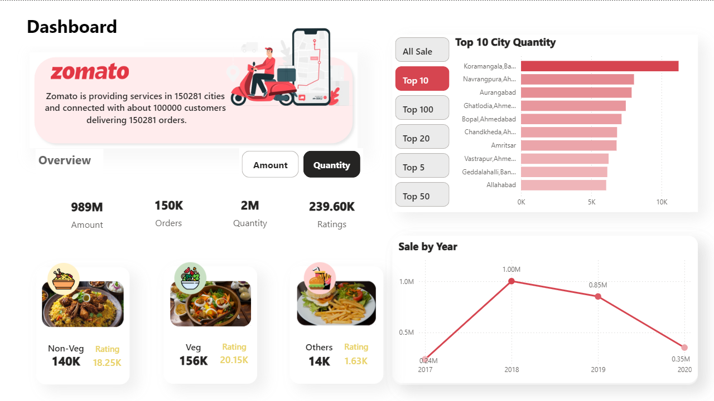

# What is this Project?
Zomato Sales Analysis Dashboard using Power BI to explore order trends, delivery performance, and regional insights. Includes key KPIs like avg. delivery time, top cities, and customer behavior patterns.

# Zomato Sales Analysis Dashboard

This project presents a comprehensive Power BI dashboard developed using Zomato sales and delivery data. The goal of this project is to understand customer behavior, analyze delivery patterns, and extract operational insights that can enhance decision-making for food delivery platforms.

The dashboard covers key business metrics such as total orders, average delivery times, customer segments, and regional trends. It serves as a powerful tool to visualize how different cities and food categories contribute to the overall performance.

Project Overview

The dataset includes attributes like order timestamps, city locations, food types, quantities, and delivery durations. The analysis dives into performance by region, demand surges, and service efficiency, providing actionable insights for delivery optimization.

Key Features

* City-wise breakdown of order volume and delivery trends
* Visual analysis of top-performing regions and food categories
* Heatmaps showing delivery concentration and customer preferences
* Metrics for average delivery time, customer density, and order frequency
* Clean, interactive dashboard layout built for real-time exploration

Tools and Technologies Used

* Power BI Desktop for dashboard creation and DAX for custom visual logic
* Excel for initial formatting and light preprocessing
* Geo-mapping and data modeling for region-based insights

How to View

Open the `.pbix` file in Power BI Desktop to explore all visualizations. The dashboard is interactive — allowing users to filter by city, food type, or time period, and view performance metrics in real time.

# About the Author

I'm Medhansh Medishetty, a data analytics enthusiast focused on solving business problems through data insights.  
This project is part of my data portfolio. You can explore more at:  
GitHub: github.com/MedhanshMedishetty  
LinkedIn: linkedin.com/in/medhanshmedishetty
